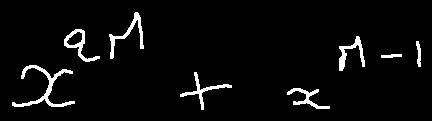
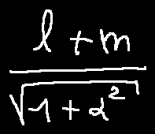
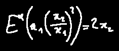
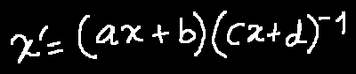
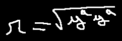
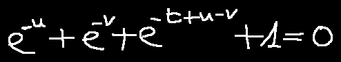
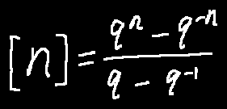
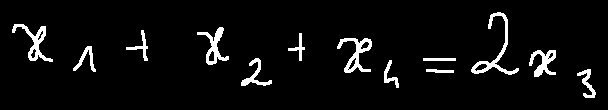

    
 
# BTTR EXPERIENCES
 

 
## Training experiences   
### Author's experiences
In the original paper, the model in trained on four NVIDIA 1080Ti GPUs with 11 × 4 GB memory. After trained 300 epochs and ensemble inference, the model achieve the accuracy of **53.96**, **52,31**, **52.96** % on the CROHME 2014/2016/2019 respectively.

### My experiences
Intentionally, I wanted to train for 300 epoch. But after realizing the model was overfit, I stopped at **240th** epoch.

I got **48.78**, **49.07**% of accuracy on the CROHME 2016/2019.

## Inferences

The model has only **6.4M** of parameters so it can run smoothly. 
I used Google Colab's GPU (Nvidia K80) and can process up to **8-9** sample/second. 
## Samples

<table>
<tr>
<td><strong>Images</strong></td>
<td><strong>Prediction</strong></td>
<td><strong>Ground-truth</strong></td>
<td><strong>Result</strong></td>
</tr>
<tr>
<td></td>
<td>x ^ { 2 M } + x ^ { M - 1 }</td>
<td>x ^ { 2 M } + x ^ { M - 1 }</td>
<td>True</td>
</tr>

<tr>
<td></td>
<td>\frac { l + m } { \sqrt { 1 + \alpha ^ { 2 } } }</td>
<td>\frac { l + m } { \sqrt { 1 + \alpha ^ { 2 } } }</td>
<td>True</td>
</tr>
<tr>
<td></td>
<td>f 2 - 2 + 2 - 2 + \cdots</td>
<td>+ 2 - 2 + 2 - 2 + \ldots</td>
<td>False</td>
</tr>
<tr>
<td></td>
<td>E ^ { \infty } ( a _ { 1 } ( \frac { x } { 2 } ) ^ { 2 } ) = 2 x _ { 2 }</td>
<td>E ^ { \alpha } ( x _ { 1 } ( \frac { x _ { 2 } } { x _ { 1 } } ) ^ { 2 } ) = 2 x _ { 2 }</td>
<td>False</td>
</tr>
<tr>
<td></td>
<td>- 6 \leq x \leq b</td>
<td>- b \leq x \leq b</td>
<td>False</td>
</tr>
<tr>
<td></td>
<td>x ^ { i } = ( a x + b ) ( c x + d ) ^ { - 1 }</td>
<td>x ^ { \prime } = ( a x + b ) ( c x + d ) ^ { - 1 }</td>
<td>False</td>
</tr>
<tr>
<td></td>
<td>r = \sqrt { y ^ { 2 } y ^ { 2 } } }</td>
<td>r = \sqrt { y ^ { a } y ^ { a } }</td>
<td>False</td>
</tr>
<tr>
<td></td>
<td>e ^ { - u } + e ^ { - t } + e ^ { - r } + 1 = 0</td>
<td>e ^ { - u } + e ^ { - v } + e ^ { - t + u - v } + 1 = 0</td>
<td>False</td>
</tr>
<tr>
<td></td>
<td>[ n ] = \frac { q ^ { n } - q ^ { - n } } { q - q - 1 }</td>
<td>[ n ] = \frac { q ^ { n } - q ^ { - n } } { q - q ^ { - 1 } }</td>
<td>False</td>
</tr>
<tr>
<td></td>
<td>x _ { 1 } + x _ { 2 } + x _ { 4 } = 2 x _ { 3 }</td>
<td>x _ { 1 } + x _ { 2 } + x _ { 4 } = 2 x _ { 3 }</td>
<td>True</td>
</tr>

</table>
